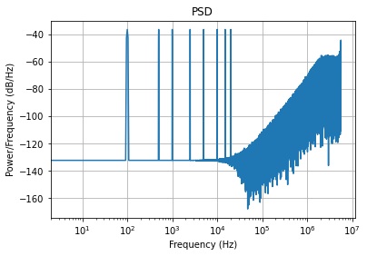
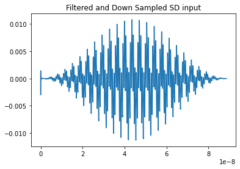
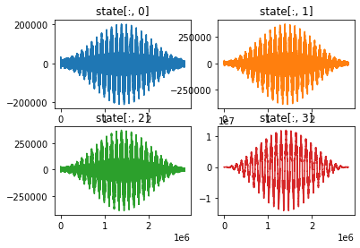
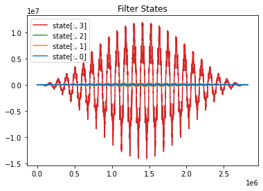
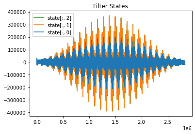
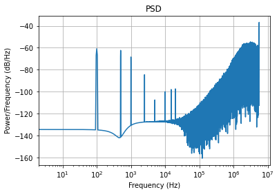
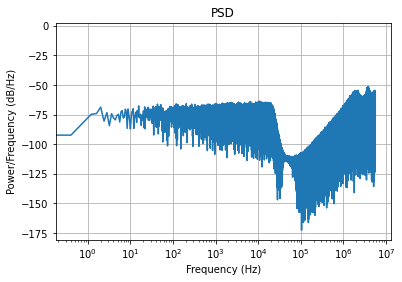
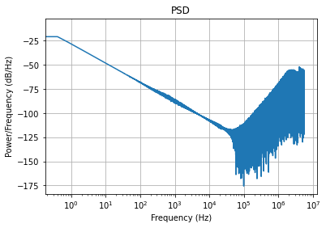

# Matlab Code
This is the transfer function from the matlab code. It's a low pass filter with a bandwidth of 2kHz.

The states.

# $\sigma$$\delta$ Modulator Input
A series of tones was encoded with a 2nd order $\sigma$$\delta$ modulator.

Here is the time domain plot. Something weird is going on at the beginning but then it settles out. Are the initial conditions wrong?

# $\sigma$$\delta$ Filter with Tones Inputted

Below is are the states from the $\sigma$$\delta$ filter.

on one plot.

The last state, 3, is much larger than the others. Below a repeat of the plot minus state 3. The matlab code indicated that all the state were about the same order of magnitude. Why is the filter different? Why is state 3 an order of magnitude larger?

Here is the PSD of the output from the $\sigma$$\delta$ filter. It sort of looks like a 2kHz LP filter.

# $\sigma$$\delta$ Filter White Noise
A random signal was generated then low pass filtered at 22050Hz, Nyquist. Here is the PSD of the $\sigma$$\delta$ encoded signal.

Here is the PSD from the $\sigma$$\delta$ filter. It doesn't look like a low 2kHz pass filter. 

