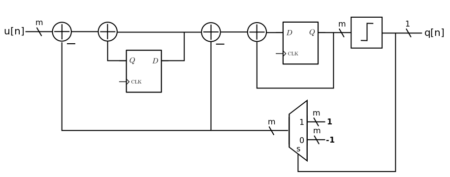
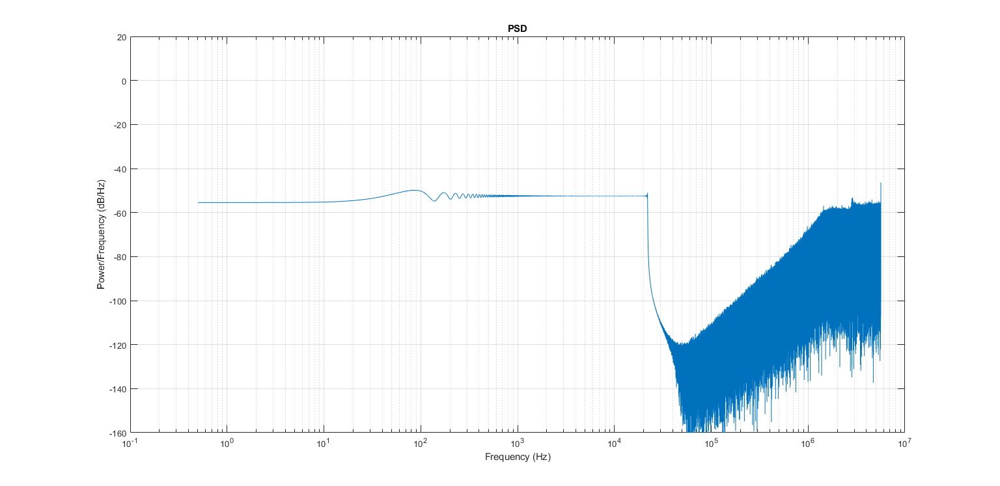
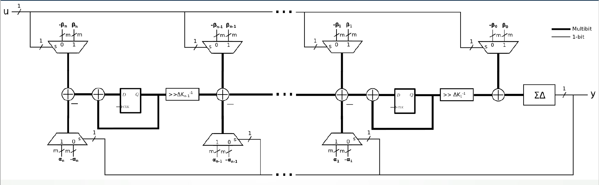
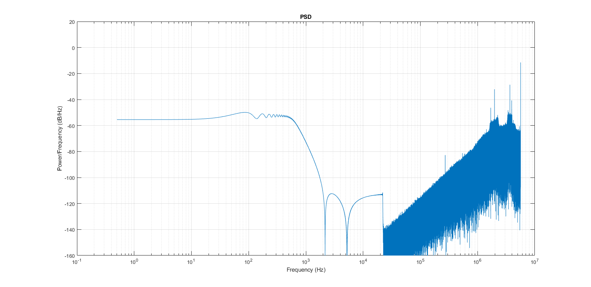
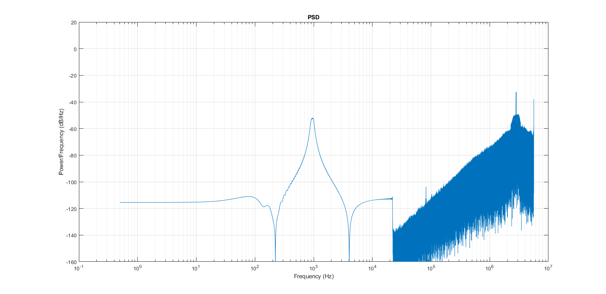
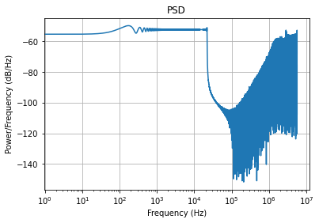
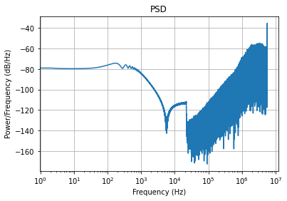
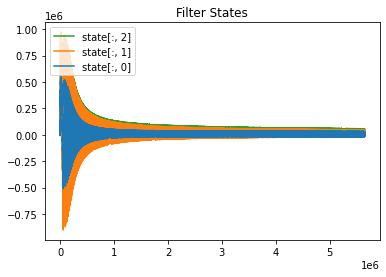
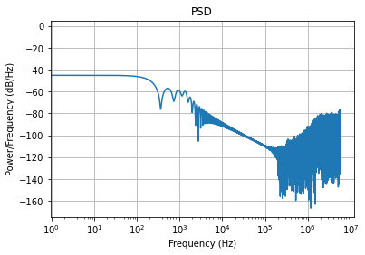
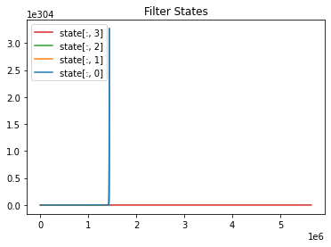

# Simulink Code
## $\Sigma\Delta$ 2nd Order Modulator
A 2nd order $\Sigma\Delta$ modulator was created with simulink. Joseph's diagram was drawn in simulink. Please see [sd_2nd_mod_top.m](https://github.com/forrest-brewer/delta-control/blob/main/sd_2nd_mod/sd_filter_top.m).

A chirp from 0Hz to 22050Hz (Nyquist) was inputted and then the PSD was plotted. It appears to be ok. 

## $\Sigma\Delta$ Filter with Modulator

The $\Sigma\Delta$ modulator was added to Joseph's simulink filter drawing. The simulink model now matches the drawing below. Please see [sd_filter_top.m](https://github.com/forrest-brewer/delta-control/blob/main/sd_2nd_mod/sd_filter_top.m).

## $\Sigma\Delta$ 2kHz LP Filter
Here is PSD of the LP filter with a chirp inputted. Looks good!

## $\Sigma\Delta$ 2kHz Notch Filter
Here is PSD of the notch filter (300Hz to 3kHz) with a chirp inputted. Looks good!

# Python Code
## $\Sigma\Delta$ 2nd Order Modulator
The behavioral code for the [$\Sigma\Delta$ modulator](https://github.com/forrest-brewer/delta-control/blob/main/python/ds_mod.py) was simulated with a chirp. The PSD looks the same as the simulink's PSD.

## Coefficients and Inputs to Models
The coefficients for the python behavioral model was generated with the matlab code and then saved to a .mat file. A chirp was used for the input then plotted below.

## $\Sigma\Delta$ 2kHz LP Filter
The python $\Sigma\Delta$ LP Filter is somewhat similar to the simulink model and the PSD is ~20db lower.

The states appear to go crazy in the beginning but then settle down. Looks like its barely stable. 

## $\Sigma\Delta$ 2kHz Notch Filter

This one doesn't work at all. It's blowing up and overflowing. 

