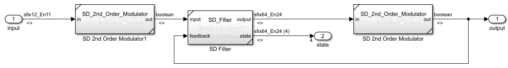
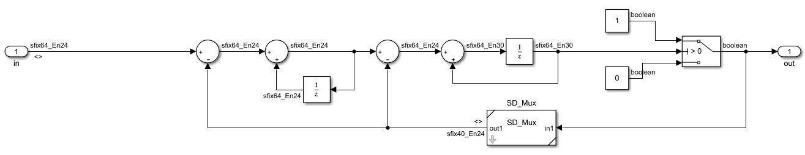
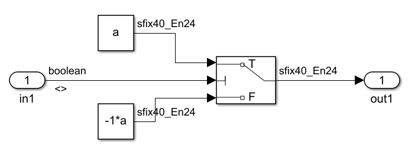
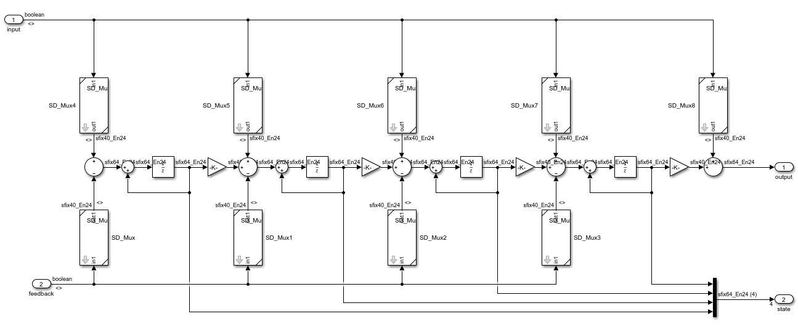

# Simulink Models

## Top Level
There is a 2nd order $\Sigma\Delta$ modulator for the input and one for the output.

## 2nd order $\Sigma\Delta$ Modulator
Here is the simulink model.

This is the mux used for both the modulator and filter. The +/- constant can be set with the mask.

## $\Sigma\Delta$ Filter

## HDL Coder

I was able to generate verilog code. The fixed point buses are huge but the PSD of a chirp looks good. HDL coder was surprisingly able to recognize the frictional power of 2 gain as a right shift operation and properly generated the verilog code. 

A test bench can be now be created. The insight gain from the sim will be very useful for debugging the problem with the python behavioral model. Optimizing the fixed point widths will help me understand the data flow better.

