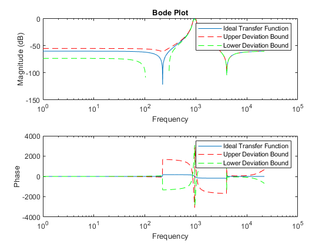
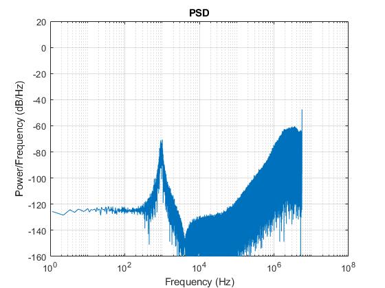
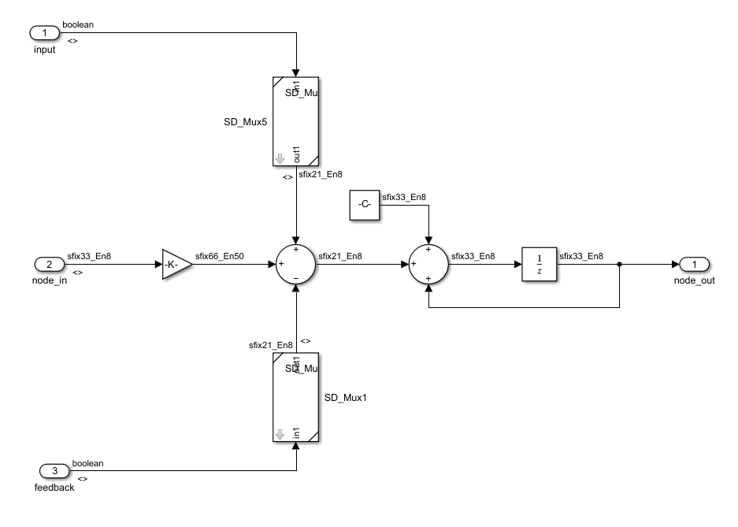
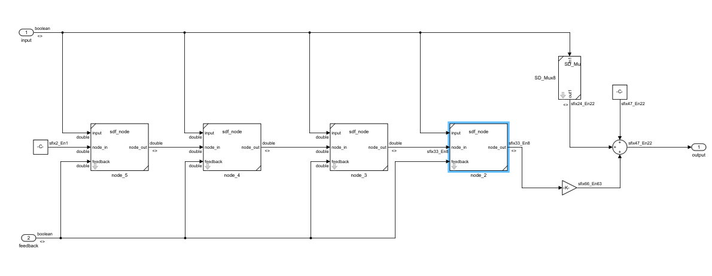
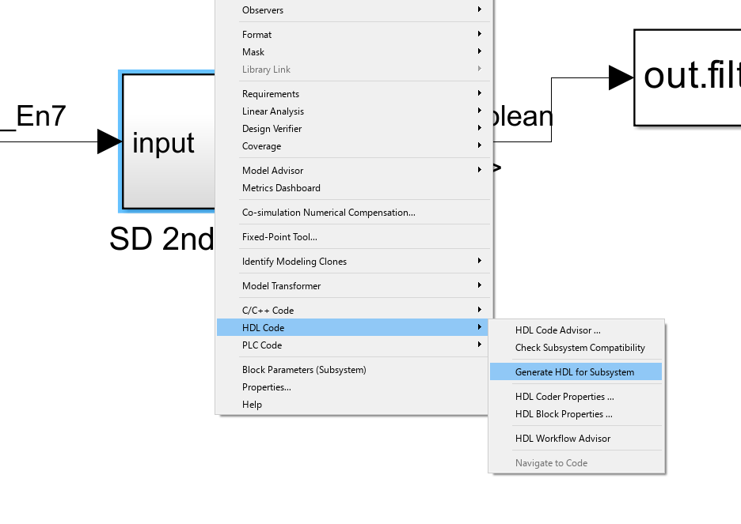

# Fixed Point Optimization

## CVX
[CVX Website](http://cvxr.com/cvx/)
1. Download and install [Redistributable: free solvers only](http://web.cvxr.com/cvx/cvx-1.22.zip)
2. cholinc has been removed and ichol should be used instead. See [Bug Fix](http://ask.cvxr.com/t/cholinc-in-quad-form-m-has-been-removed-in-matlab-13/196)

## Before Fixed Point Optimization

## Joesph's Mcode

[SD_Filter_Design](https://github.com/forrest-brewer/delta-control/SD_Filter_Design)

### Bode plot for bandpass filter

### PSD with Fixed Point Optimization

## Simulink $\Sigma\Delta$ Filter Node

## Simulink $\Sigma\Delta$ Filter

## HDL Coder

Generic Verilog code with optimized bit widths can now be generated. HDL coder recognized the frictional power of 2 gain as a right shift operation and properly inferred the Verilog code. There's no check for saturation. Overflows just bit wrap.

Execute the [top level module](https://github.com/forrest-brewer/delta-control/blob/main/sd_filter_fp/sd_filter_top.m) to run Joesph's optimization mcode and the fixed point solver.

The [top level simulink](https://github.com/forrest-brewer/delta-control/blob/main/sd_filter_fp/sd_filter_tb.slx) module is sd_filter_tb.slx. Right click on the *SD 2nd Order Modulator subsystem* to generate the HDL code.

The [generated verilog](https://github.com/forrest-brewer/delta-control/blob/main/sd_filter_fp/hdlsrc.zip) can also be downloaded. 

