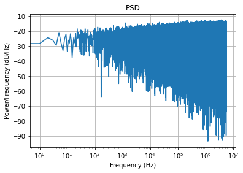
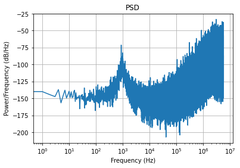

# Test Bench for Cheby2 Bandpass Filter - 300Hz to 3KHz

This is for simulating the SystemVerilog files in the */src/sd_filter* directory of the git repository. Anaconda and either QuestaSim or ModelSim are required. The top level file is *tb_top.sv*.

1. Start Spyder and cd to the */sim/tests/python* directory
2. Run the *make_noise.py* script to generate the input then plot the PSD

3. Start QuestaSim or ModelSim then cd from the TCL command line to the */sim/tests/tb_sd_filter* directory
4. Run the `do ./init_test.do` TCL command
5. The test will take awhile and is complete when `# Test Done!` is displayed from the TCL command line
6. Run the *check_noise.py* script from Spyder to plot the PSD of the filter output

