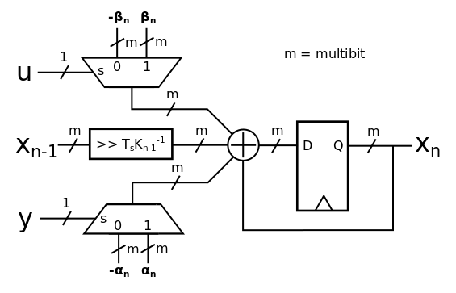

# Synthesizable and parameterizable SystemVeriog code to implement a $\Sigma\Delta$ filter

## sd_modulator.sv
2nd order $\Sigma\Delta$ modulator that has a parameterizable fixed point input.

## sd_filter_top.sv
The top level file that has the input and output 2nd order $\Sigma\Delta$ modulator along with the $\Sigma\Delta$ filter. The input $\Sigma\Delta$ converts a sfix16_En7 fixed point integer to a single bit PDM signal. The output $\Sigma\Delta$ modulator encode the feedback path of the $\Sigma\Delta$ IIR filter. 

## sd_filter.sv
This is were the filter nodes are instantiated along with the parameters to configure each node.

## sd_filter_pkg.sv 
Contains the structure for parameterizing the fixed bit withs of the filter nodes. These parameters are generated by the python code.

`
  typedef struct packed {
    int  IN_W ;  // previous node width
    int  IN_N ;  // previous node fractional width
    int  S    ;  // accumulator width
    int  C_W  ;  // accumulator fractional width
    int  C_N  ;  // right shift
    int  OUT_W;  // coefficient width
    int  OUT_N;  // coefficient fractional width
  } sd_filter_cfg_t;
`

## sd_filter_node.sv

The code to implement the filter architecture below. It takes parameters for the $\alpha$ and $\beta$ coefficients calculated with the python code along with the structure containing the fixed point widths. 

## scaler_mux.sv
A MUX with a parameterizable fixed point output of either the positive or negative value. 
